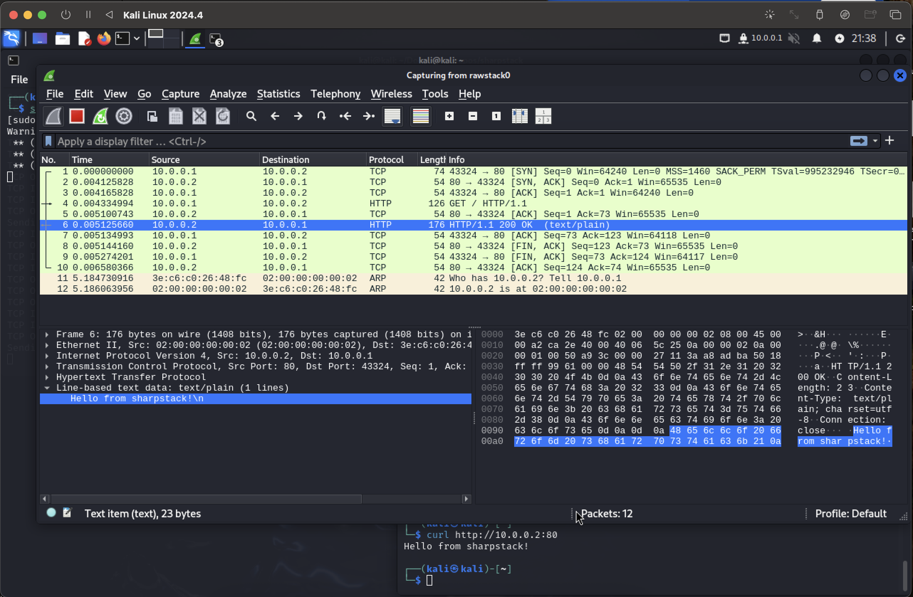

# Full networking stack + minimal http server in C#/.NET

[](https://github.com/markCwatson/sharpstack/actions/workflows/tests.yml)



This is a full networking stack and minimal http server written in C#12/.NET10 without the use of `System.Net`. In the image above, the TCP handshake and subsequesnt HTTP request can be seen in wireshark with the response highlighted.

Most of the C# code is hand-written (with the exception of tests which are 100% AI gernerated).

## Function

Run a local http server and do this

```shell
ping 10.0.0.2
```

and you will receive an ICMP echo response, and this

```shell
curl http://10.0.0.2:80/
```

and it will return an HTTP response - through the custom stack - from the http application.

## Running on Linux

Since I am using a TAP, it has to be run on Linux. I have to use a TAP because for a real http server like nginx, the kernel handles the networking stack + socket.

```
NIC -> kernel Ethernet/IP/TCP -> socket -> nginx
```

And since I want to implement a simple Ethernet/ARP/IPv4/ICMP/TCP stack, then I need to bypass the kernel's protocol processing of these frames simulating as if I was reading directly from the NIC. A TAP device acts as a virtual Layer 2 Ethernet interface.

To setup the TAP on Linux, run

```shell
./scripts/tap-setup.sh
```

then run the server

```shell
./scripts/run.sh
```

Then call it from the host:

```shell
curl -i http://10.0.0.2:8080/
```
