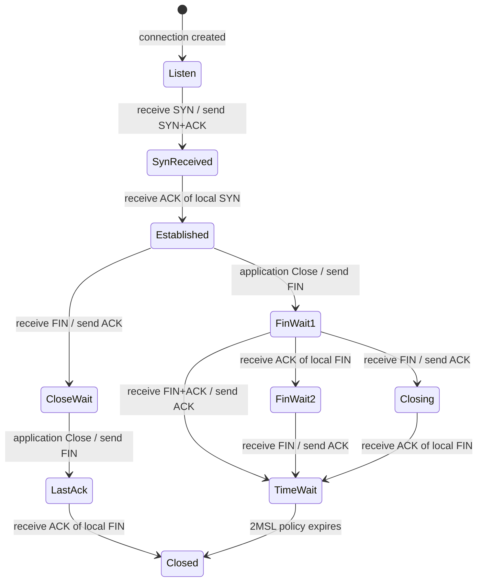

# TCP connection state machine

`TcpConnection` implements the passive-open side of a small TCP state machine.
It owns TCP state, send and receive sequence space, and accepted stream bytes.
It produces complete `TcpPacket` values but does not know about IP addresses,
MAC addresses, or checksums.

The current TCP standard is [RFC 9293](https://www.rfc-editor.org/rfc/rfc9293.html),
which obsoletes RFC 793. The most relevant sections are:

- [Section 3.3.1](https://www.rfc-editor.org/rfc/rfc9293.html#section-3.3.1): TCP control block variables
- [Section 3.3.2](https://www.rfc-editor.org/rfc/rfc9293.html#section-3.3.2): state machine overview
- [Section 3.4](https://www.rfc-editor.org/rfc/rfc9293.html#section-3.4): sequence and acknowledgment numbers
- [Section 3.5](https://www.rfc-editor.org/rfc/rfc9293.html#section-3.5): connection establishment
- [Section 3.6](https://www.rfc-editor.org/rfc/rfc9293.html#section-3.6): connection closing
- [Section 3.10.7](https://www.rfc-editor.org/rfc/rfc9293.html#section-3.10.7): processing arriving segments

## States and events

Incoming segments enter through `Receive`. Application actions enter through
`Send` and `Close`. Keeping those events separate prevents packet encoding,
application policy, and TCP state transitions from becoming one control path.



The implementation does not support active open, so RFC 9293's `SYN-SENT`
state is intentionally absent. `TcpState` is public so tests and orchestration
can use the same protocol vocabulary as the connection.

## Sequence space

The connection fields correspond to the RFC 9293 transmission control block
variables in Section 3.3.1:

| Implementation field  | RFC term  | Meaning                                           |
| --------------------- | --------- | ------------------------------------------------- |
| `_sendUnacknowledged` | `SND.UNA` | Oldest local sequence number not yet acknowledged |
| `_sendNext`           | `SND.NXT` | Next local sequence number to emit                |
| `_receiveNext`        | `RCV.NXT` | Next peer sequence number accepted in order       |

One private `Emit` method creates every outbound segment and advances
`SND.NXT`. Payload consumes one sequence number per byte. SYN and FIN each
consume one sequence number. An ACK with no payload consumes none. Receiving an
acceptable ACK can advance `SND.UNA`, but never advances `SND.NXT`.

Incoming payload is accepted only when its first sequence number equals
`RCV.NXT`. Accepted bytes are appended to the connection's receive stream and
advance `RCV.NXT`. An accepted SYN or FIN advances it by one more. Duplicate or
out-of-order sequence space is not appended or dispatched to the application;
the connection returns its current cumulative ACK instead.

## Passive open

For peer initial sequence number `C` and the deterministic local initial
sequence number `10,000`, the passive handshake follows RFC 9293 Figure 6:

```text
Peer                                        Server
SYN, seq=C                         ------->  LISTEN -> SYN-RECEIVED
                                  <-------  SYN+ACK, seq=10000, ack=C+1
ACK, seq=C+1, ack=10001            ------->  SYN-RECEIVED -> ESTABLISHED
```

The local and remote ports are fixed when the connection is constructed. An
outbound packet therefore does not depend on whichever incoming packet happened
to arrive most recently.

## Application data

`TcpResult` separates transport output from notifications:

- `Outbound` contains ordered TCP packets to encode.
- `DataAvailable` says newly accepted bytes were appended to the stream.
- `PeerClosed` says an in-order FIN was accepted.

`TcpServer` invokes its application only when `DataAvailable` is true. The
application reads `GetReceivedData`, consumes complete input with `ConsumeData`,
and returns an `ApplicationResult`. A non-empty response is passed to `Send`.
Its explicit `CloseConnection` decision is then passed to `Close`.

An accepted request can therefore produce three ordered packets: an immediate
ACK, response data with `PSH+ACK`, and a separate `FIN+ACK`. ACK piggybacking is
an optimization outside the current design.

## Connection close

RFC 9293 Section 3.6 distinguishes a peer FIN from the application's CLOSE
event. This implementation preserves that distinction.

On peer-initiated close, `Receive(FIN)` acknowledges the FIN and enters
`CLOSE-WAIT`; it does not send the local FIN. A later `Close()` enters
`LAST-ACK` and sends the FIN. The final acceptable ACK enters `CLOSED`, after
which `TcpServer` removes the four-tuple entry.

On local close, `Close()` enters `FIN-WAIT-1`. An ACK of the local FIN enters
`FIN-WAIT-2`; a subsequent peer FIN is acknowledged and enters `TIME-WAIT`.
A FIN arriving before the local FIN is acknowledged enters `CLOSING`, and its
later ACK enters `TIME-WAIT`. A segment containing both the peer FIN and an ACK
of the local FIN enters `TIME-WAIT` directly.

`TIME-WAIT` has an explicit lifetime. The default is one minute, representing a
2MSL policy with a 30-second MSL. Both the clock and duration are injectable for
deterministic tests. A retransmitted FIN is acknowledged and restarts the
TIME-WAIT interval. `TcpServer` retains the connection until
`TryExpireTimeWait` permits replacement.

## Output path

Protocol and wire responsibilities are deliberately separate:

```text
TcpConnection.Receive / Send / Close
    -> ordered TcpPacket values
TcpServer
    -> application orchestration and four-tuple lookup
TcpFrameEncoder
    -> TCP checksum, IPv4 checksum, IPv4 and Ethernet wrapping
Stack
    -> ordered EthernetFrame values
StackRunner
    -> one device write per frame, in order
```

`TcpFrameEncoder` calculates the TCP checksum using the IPv4 pseudo-header from
RFC 9293 Section 3.1 and calculates the checksum over the outgoing IPv4 header.
It has no mutable sequence or connection state.

## Remaining RFC gaps

This is an educational stack, not a production TCP implementation. Important
limitations remain:

- The initial sequence number is deterministic. RFC 9293 Section 3.4.1 requires
  a changing, difficult-to-guess ISN.
- There are no retransmission queues or timers for SYN, data, or FIN.
- There is no out-of-order reassembly, receive-window processing, send-window
  processing, congestion control, or flow control.
- ACK acceptability uses simple numeric comparisons and does not implement
  serial-number wraparound arithmetic.
- RST processing, urgent data, TCP options, simultaneous open, and challenge
  ACK behavior are not implemented.
- The encoder mirrors basic IPv4 header fields and does not implement IP option
  handling or fragmentation.
- TIME-WAIT cleanup is checked when the server next accesses a connection; no
  background scheduler proactively removes expired entries.

The state behavior is tested in
[`TcpConnectionTests.cs`](../tests/App.Tests/TcpConnectionTests.cs), wire output
in [`TcpFrameEncoderTests.cs`](../tests/App.Tests/TcpFrameEncoderTests.cs),
server orchestration in
[`TcpServerTests.cs`](../tests/App.Tests/TcpServerTests.cs), and multi-frame
device output in [`StackTests.cs`](../tests/App.Tests/StackTests.cs).

For a line-by-line packet exchange and capture instructions, see
[Reading the TCP log with Wireshark](tcp-log-and-wireshark.md).
